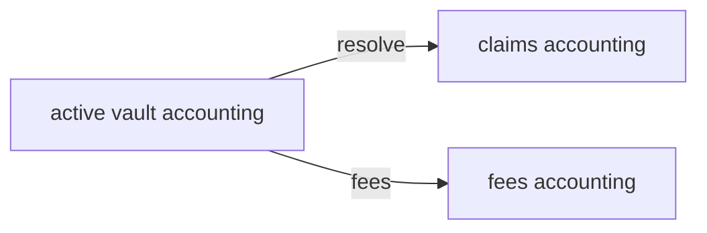

# Engine boundaries

## Single stake asset

[`MarketEngine`](../src/MarketEngine.sol) binds **one** `stakeToken` at [`initialize`](../src/MarketEngine.sol). All of the following are denominated in that token’s smallest units:

- Per-epoch pools (`outcomePools`, `totalPool`)
- User positions (`stakes`, `totalStake`)
- Vault buckets ([`VaultBalances`](../src/types/MarketTypes.sol)): `active`, `claims`, `fees`
- Fees (`switchFeeBps`, settlement fee) and claims

There is **no** built-in conversion from ETH, USDT, or cross-chain assets inside the engine. Any “pay with what you have” flow must end with a transfer of `stakeToken` into the engine (directly or via an approved pattern below).

## Vault accounting (same idea as multi-vault Solana)

The EVM contract holds one ERC-20 balance but tracks three logical pools per template:

See [`getVaultBalances`](../src/MarketEngine.sol) and [`VaultBalances`](../src/types/MarketTypes.sol). Abstraction work **does not** split these buckets differently; it only affects **how** stake token reaches `depositToSide` / `depositToSideFor`.

## Position keys and `msg.sender`

Positions are keyed by `(templateId, epochId, userAddress)` (see `positionKey` in [`MarketEngine`](../src/MarketEngine.sol)). The **user** whose address is stored must be the one who **claims** after resolution.

- [`depositToSide`](../src/MarketEngine.sol) credits `msg.sender`.
- A naive “router” that calls `depositToSide` would credit the **router**, not the end user — **wrong**. See [02-integration-modes.md](./02-integration-modes.md) and [`depositToSideFor`](../src/MarketEngine.sol) (executor credits a `beneficiary`).

## Non-goals (v1 abstraction docs)

- Multi-collateral pools inside `MarketEngine` (separate markets per asset).
- Oracle or resolver changes for “payment token” — oracles resolve **market outcomes**, not user funding rails.
- Replacing `stakeToken` per template without a full protocol upgrade path.

These belong to a separate product/upgrade epic.
