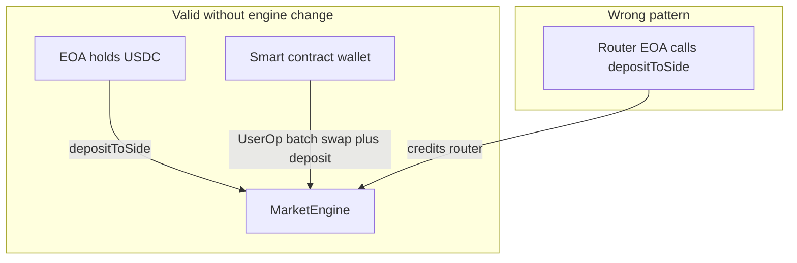
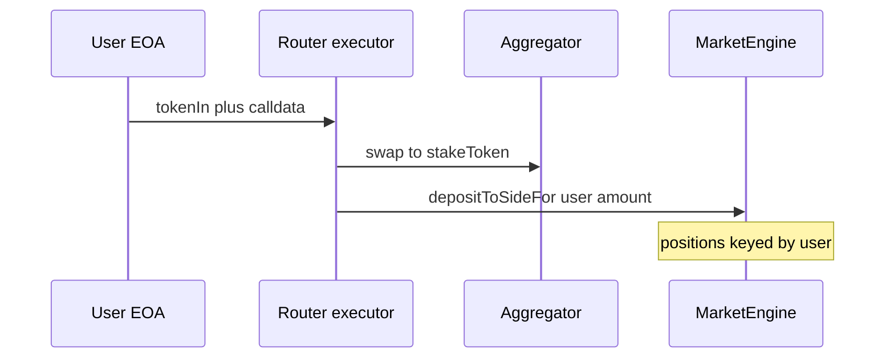

# Integration modes (tiers)

## The core constraint: who gets credited?

[`depositToSide`](../src/MarketEngine.sol) does:

- `stakeToken.safeTransferFrom(msg.sender, address(this), amount)`
- Updates `positions[positionKey(templateId, epochId)][msg.sender]`

So **the caller’s address** owns the position. Chain abstraction must preserve **end-user ownership** of claims.

## Tier A — Frontend-only

1. User has arbitrary asset on the deployment chain.
2. UI uses a DEX aggregator (1inch, 0x, Uniswap API, etc.) to swap to **stake token**.
3. User submits `depositToSide` (second transaction unless wallet batches **two** user txs).

**Pros:** No contract changes. **Cons:** Two steps or dependency on wallet batching support.

## Tier B — Smart account (ERC-4337)

The user’s **smart wallet** is `msg.sender` for a **single UserOp** that:

1. Swaps to stake token (via embedded call to DEX / aggregator), and  
2. Calls `depositToSide` on `MarketEngine`.

Because `msg.sender` is the user’s SCW, positions and claims belong to the user.

**Pros:** One user-facing confirmation; no `depositToSideFor` required. **Cons:** Users must use a compatible SCW; bundler/paymaster setup for gas abstraction is separate from stake token.

## Tier C — Router / executors + `depositToSideFor`

For EOAs that cannot batch in one SCW UserOp:

1. Deploy a **router** (or use an approved executor contract) that:
   - Pulls user’s `tokenIn`, swaps to stake token **into the router’s balance**,
   - Approves `MarketEngine`,
   - Calls [`depositToSideFor(beneficiary, ...)`](../src/MarketEngine.sol) so the **beneficiary** (EOA) is credited.

Executors are **gated** (`setDepositExecutor`) so random contracts cannot credit arbitrary users with pulled funds without protocol trust.

**Pros:** One transaction UX for EOA + router pattern. **Cons:** Trust / audit surface on executor set; admin must govern allowlist.

## Tier D — Intents / solvers (off-chain + settlement)

User signs an **intent** (“deliver X stake token into market Y for my address”). A **solver** finds swap/bridge paths and submits the settling tx that ends in `depositToSide` (SCW) or `depositToSideFor` (executor). See [05-solvers-and-intents.md](./05-solvers-and-intents.md).

## Choosing a tier

| Situation | Suggested path |
|-----------|------------------|
| Fastest to ship | Tier A |
| Best one-tx UX, user has SCW | Tier B |
| One-tx UX, EOA, trusted router | Tier C |
| Cross-chain + competitive fills | Tier D (later) |
