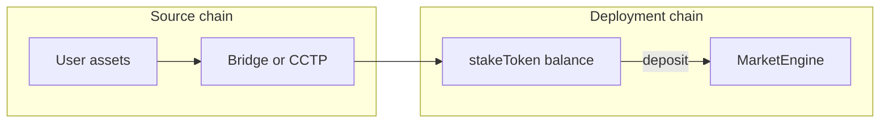

# Cross-chain and bridges

[`MarketEngine`](../src/MarketEngine.sol) runs on **one chain** per deployment. Users on other chains must obtain **`stakeToken` on that chain** before calling `depositToSide` / `depositToSideFor`.

## Pattern

## Orchestration options (documentation only)

- **USDC:** Circle **CCTP** where supported; native USDC bridging semantics vary by chain.
- **General:** **Across**, **Stargate**, **Socket**, **LiFi** (API aggregates bridge + swap routes).

These are **not** embedded in `MarketEngine`. Your app or a router:

1. Completes bridge + optional swap so the user (or executor) holds `stakeToken` on the deployment chain.
2. Calls `depositToSide` or `depositToSideFor` as in [02-integration-modes.md](./02-integration-modes.md).

## Operational notes

- **Finality:** Wait for bridge confirmation before relying on balance for deposit.
- **Token identity:** Ensure mint matches your configured `stakeToken` address on the deployment chain (USDC is not single-address across all chains).
- **Compliance:** Bridge KYC / jurisdiction is outside the engine; document in your product terms.
