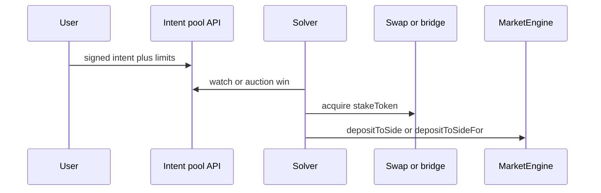

# Solvers and intents

## Goal

User expresses **intent**: “Fund market *M* with *value* from *whatever I have*.” A **solver** (or **filler**) competes to deliver **stake token** into [`MarketEngine`](../src/MarketEngine.sol) under the user’s constraints.

## Dependency on integration tier

| Settlement path | Requirement |
|-----------------|-------------|
| Solver submits tx as user’s **SCW** | Tier B — `msg.sender` is user wallet |
| Solver uses **executor** + `depositToSideFor` | Tier C — engine must allowlist executor; router holds stake token then deposits for user |
| CoW / UniswapX style batch | Settlement contract must output stake token and call your **hook** (router or engine) |

The engine does **not** parse intent formats (EIP-7683, etc.) itself — those live in **intent protocols** or your **off-chain order pool**.

## High-level flow

## Operational requirements

- **Expiry:** Intents should time out; stale orders must not settle after market closes.
- **Minimum out:** Encode min stake token or equivalent into the intent; executor enforces before deposit.
- **Incentives:** Solver profit from spread, explicit fee, or protocol subsidy; document who pays gas on failed simulation.

## Relation to CoW / UniswapX

- **CoW:** Batch settlement; custom **interaction** after token transfers can call your router.
- **UniswapX / similar:** Fillers deliver **output** token to a specified recipient; recipient can be router that calls `depositToSideFor`.

Exact integration is **per deployment** (chain, reactor addresses, hook ABI).
