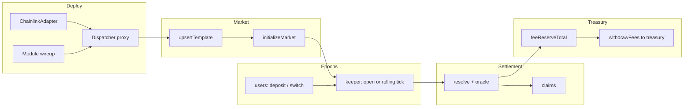
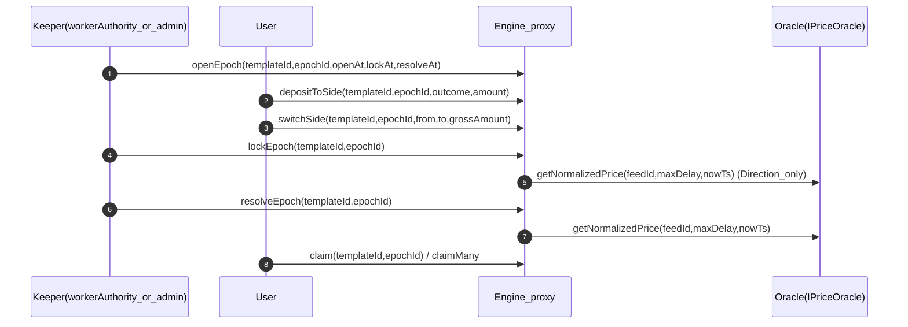
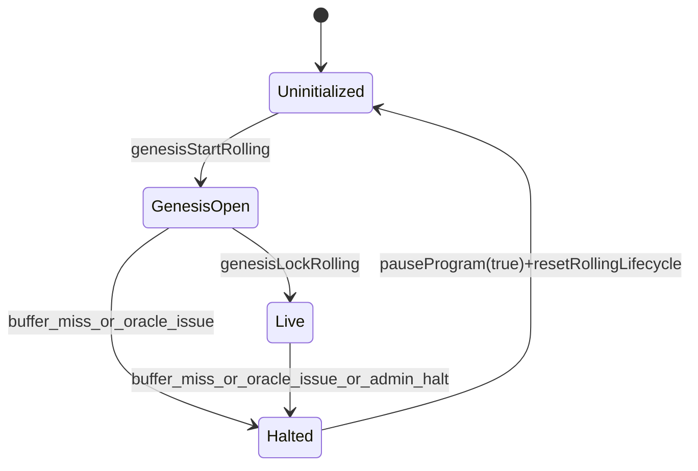
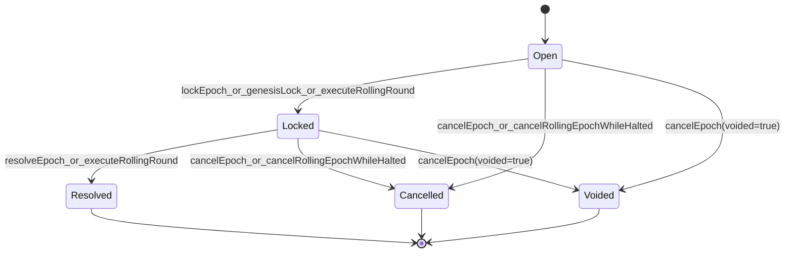

# RetroPick `MarketEngine` (rolling rounds prediction markets) — technical reference

This is the deep, code-accurate documentation for the current Solidity implementation under the modular dispatcher architecture in [`src/engine/MarketEngineDispatcher.sol`](../src/engine/MarketEngineDispatcher.sol) and [`src/engine/modules/`](../src/engine/modules/). It focuses on: storage model, epoch/round lifecycle, rolling execution, oracle checkpoints, keeper behavior, deployment topology, and measured gas from [`.gas-snapshot`](../.gas-snapshot).

> Migration note: the historical monolith lives under [`.docs/legacyEngine.sol`](./legacyEngine.sol) for diff/reference only. Production paths use [`MarketEngineDispatcher`](../src/engine/MarketEngineDispatcher.sol) + [`src/engine/modules/`](../src/engine/modules/).

## Glossary

- **Template**: A market definition keyed by `templateId`.
- **Epoch**: One full market cycle (open → lock → resolve → claim). In product language this is often called a “round.”
- **Ledger**: Per-template cursor + reserve accounting + rolling lifecycle state.
- **Checkpoint A**: Oracle sample at **lock** for Direction markets (open price).
- **Checkpoint B**: Oracle sample at **resolve** for all markets (close / settlement price).
- **Manual**: Keeper runs discrete `openEpoch` / `lockEpoch` / `resolveEpoch`.
- **Rolling**: Pancake-style pipeline: one keeper call advances resolve + lock + open per interval.

## 0) End-to-end operations: deploy → new template → settlement → treasury

This is the **operator narrative** for the current codebase. Every call uses the **same UUPS proxy address**; the proxy’s `fallback` `delegatecall`s into a **module** chosen by `msg.sig` ([`MarketEngineDispatcher`](../src/engine/MarketEngineDispatcher.sol)). Shared storage is defined once in [`MarketEngineState`](../src/engine/MarketEngineState.sol); modules only supply code.

### 0.1 Cold deploy (one protocol instance on a chain)

1. Deploy [`ChainlinkAdapter`](../src/adapters/ChainlinkAdapter.sol) (sequencer feed address or `address(0)` on L1).
2. Deploy **`MarketEngineDispatcher`** behind an ERC-1967 UUPS proxy with `initialize(...)` in the initializer path ([`script/Deploy.s.sol`](../script/Deploy.s.sol) uses OpenZeppelin Foundry Upgrades — **`--ffi`** for validation).
3. In the same broadcast, deploy **five module contracts** and register each public entrypoint with `setSelectorModule(selector, module, immutableFlag)` on the **proxy**:
   - [`MarketEngineAdminModule`](../src/engine/modules/MarketEngineAdminModule.sol) — `pauseProgram`, `setTreasury` / `setWorkerAuthority`, `setDepositExecutor`, `setYieldRouter` / `setLmRewardsEnabled`, `keeperClaimLmRewards`, `yieldEmergencyWithdraw`, `initializeMarket`, `withdrawFees`
   - [`MarketEngineCoreLifecycleModule`](../src/engine/modules/MarketEngineCoreLifecycleModule.sol) — `upsertTemplate`, manual `openEpoch` / `lockEpoch` / `resolveEpoch` (+ batches), `cancelEpoch` (when rolling is not `Live`)
   - [`MarketEngineRollingLifecycleModule`](../src/engine/modules/MarketEngineRollingLifecycleModule.sol) — `genesisStartRolling`, `genesisLockRolling`, `executeRollingRound` (+ batch), `haltRollingMarket`, `cancelRollingEpochWhileHalted`, `resetRollingLifecycle`
   - [`MarketEngineUserOpsClaimsModule`](../src/engine/modules/MarketEngineUserOpsClaimsModule.sol) — `depositToSide`, `depositToSideFor`, `switchSide`, `claim`, `claimMany`
   - [`MarketEngineViewModule`](../src/engine/modules/MarketEngineViewModule.sol) — `getUserEpochs`, `getVaultBalances`, `getRollingLifecycle`, `getEpoch`

Selectors not mapped revert with `ModuleNotSet(selector)`. The dispatcher **keeps** `initialize`, `upgradeToAndCall`, `proxiableUUID`, and `setSelectorModule` on the root contract (not delegated).

A full selector matrix lives in [`.docs/migrations/marketengine_selector_matrix.md`](./migrations/marketengine_selector_matrix.md).

### 0.2 Optional: Aave yield router

1. Deploy [`YieldRouterV2`](../src/yield/YieldRouterV2.sol) (or [`YieldRouterAaveV3`](../src/yield/YieldRouterAaveV3.sol) implementing the same [`IYieldRouterV2`](../src/interfaces/IYieldRouterV2.sol)).
2. **`admin`** on the engine: `setYieldRouter(router, yieldFeeBps)`. Clearing the router zeroes `yieldFeeBps` and disables LM claims.
3. **Router owner** (separate from engine admin): register each `templateId` and optional Stata path per router docs.

### 0.3 Launching a new market (template)

| Step | Actor | Call | Result |
|------|-------|------|--------|
| 1 | `admin` | `upsertTemplate` | Writes `_templates[templateId]` with type, oracle `feedId`, fees, execution mode, rolling timings, etc. `templateId = keccak256(bytes(slug))`. |
| 2 | `admin` | `initializeMarket(templateId)` | Sets `ledger.initialized = true`, `rollingNextEpochId = 1`, rolling phase `Uninitialized`. No epochs yet. |

Then either **manual** `openEpoch(...)` or **rolling** `genesisStartRolling` begins user-facing rounds.

### 0.4 Where protocol revenue accumulates

- **`ledger.feeReserveTotal`** and **`_vaults[templateId].fees`** track amounts reserved for the protocol (switch fees, settlement fees, yield fee slice, and certain yield surpluses — see §13.5).
- **`withdrawFees(templateId, amount)`** ([`MarketEngineAdminModule`](../src/engine/modules/MarketEngineAdminModule.sol)): **`treasury` or `admin`** may pull `stakeToken` to the configured **`treasury`** address; accounting uses [`MarketMath.releaseFeeOnWithdraw`](../src/math/MarketMath.sol).

Claims draw from **`claimsReserveTotal`** / `vaults.claims`, not from fee reserves.

### 0.5 Flow diagram (high level)



## 1) What is deployed

### 1.1 One engine, many markets

RetroPick deploys **one** UUPS proxy whose implementation is [`MarketEngineDispatcher`](../src/engine/MarketEngineDispatcher.sol). The **proxy address** is the engine; execution is delegated to modules, but **all storage** is the single layout in [`MarketEngineState`](../src/engine/MarketEngineState.sol) (templates, ledgers, epochs, positions, vault mirrors, yield router pointer, selector routing).

The engine computes:

- `templateId = keccak256(bytes(slug))`
- `positionKey = keccak256(abi.encodePacked(templateId, epochId))`

```186:192:/home/asyam/dev/Project/RetroPick/V1/contracts/retropick_v2_engine_solidity/src/engine/MarketEngineState.sol
    function templateIdFromSlug(string memory slug) public pure returns (bytes32) {
        return keccak256(bytes(slug));
    }

    function positionKey(bytes32 templateId, uint64 epochId) public pure returns (bytes32) {
        return keccak256(abi.encodePacked(templateId, epochId));
    }
```

### 1.2 Oracle adapter

[`ChainlinkAdapter`](../src/adapters/ChainlinkAdapter.sol) implements [`IPriceOracle`](../src/interfaces/IPriceOracle.sol) over Chainlink [`AggregatorV3Interface`](../lib/chainlink-brownie-contracts/contracts/src/v0.8/shared/interfaces/AggregatorV3Interface.sol). It:

- Decodes `feedId` as a Chainlink **proxy address**: `address(uint160(uint256(feedId)))`.
- Reads `latestRoundData()`, enforces round completeness, positive `answer`, and staleness against `maxAgeSeconds` using `updatedAt`.
- Normalizes `answer` with `decimals()` to **e8** (same scale as the rest of the engine).
- Returns `confidenceE8 = 0` (no Chainlink confidence band).
- On **L2**, checks the Chainlink **sequencer uptime feed** passed in the adapter constructor; on **L1** pass `sequencerFeed = address(0)` to skip. Grace-period behavior follows [Chainlink L2 sequencer feeds](https://docs.chain.link/data-feeds/l2-sequencer-feeds) (`timeSinceUp <= 3600` reverts until strictly after the grace window).
- **Optional round ID surface**: the adapter also implements [`IPriceOracleWithRoundId`](../src/interfaces/IPriceOracleWithRoundId.sol) with `getNormalizedPriceWithRoundId(...)`, returning the Chainlink `roundId` from `latestRoundData()` alongside the normalized price. The engine uses this (when the cast succeeds) for **monotonic oracle cursor** checks per `(templateId, feedId)` plus `EpochLockedV2` / `EpochResolvedV2` events (see §9.4). If the oracle does not implement the extension, the engine falls back to `getNormalizedPrice` only.

```32:60:/home/asyam/dev/Project/RetroPick/V1/contracts/retropick_v2_engine_solidity/src/adapters/ChainlinkAdapter.sol
    function getNormalizedPrice(bytes32 feedId, uint64 maxAgeSeconds, uint64)
        external
        view
        override
        returns (int256 priceE8, uint64 publishTime, uint256 confidenceE8)
    {
        _checkSequencer();

        address feedAddr = address(uint160(uint256(feedId)));
        if (feedAddr == address(0)) revert InvalidFeedAddress();

        AggregatorV3Interface feed = AggregatorV3Interface(feedAddr);

        (uint80 roundId, int256 answer,, uint256 updatedAt, uint80 answeredInRound) = feed.latestRoundData();

        if (answeredInRound < roundId) revert RoundNotComplete(roundId, answeredInRound);
        if (answer <= 0) revert InvalidPrice();
        if (updatedAt == 0) revert InvalidPrice();

        if (block.timestamp - updatedAt > uint256(maxAgeSeconds)) {
            revert StalePriceFeed(updatedAt, uint256(maxAgeSeconds), block.timestamp);
        }

        uint8 d = feed.decimals();
        priceE8 = _normalizeToE8(answer, d);
        publishTime = uint64(updatedAt);
        confidenceE8 = 0;
    }
```

### 1.3 Deployment topology (UUPS proxy + modules)

[`script/Deploy.s.sol`](../script/Deploy.s.sol) (with **`--ffi`** for OpenZeppelin upgrades checks):

1. Reads env: `STAKE_TOKEN`, `SEQUENCER_FEED` (`address(0)` on L1), `ADMIN`, `TREASURY`, `WORKER`, fee caps, oracle globals.
2. Deploys `ChainlinkAdapter(sequencerFeed)`.
3. Deploys a **UUPS proxy** for **`MarketEngineDispatcher`** with `initialize(IERC20,IPriceOracle,admin,treasury,worker,...)` (`OracleKind.Chainlink`).
4. Deploys the five module contracts and calls `setSelectorModule` on the proxy for each routed function selector (admin / core lifecycle / rolling / user+claims / view).

Core fragment:

```66:94:/home/asyam/dev/Project/RetroPick/V1/contracts/retropick_v2_engine_solidity/script/Deploy.s.sol
        ChainlinkAdapter adapter = new ChainlinkAdapter(sequencerFeed);

        bytes memory initData = abi.encodeCall(
            MarketEngineDispatcher.initialize,
            (
                IERC20(stakeToken),
                IPriceOracle(address(adapter)),
                admin,
                treasury,
                worker,
                defFee,
                maxSw,
                maxOut,
                MarketTypes.OracleKind.Chainlink,
                delay,
                conf
            )
        );

        Options memory opts;
        address proxy =
            Upgrades.deployUUPSProxy("engine/MarketEngineDispatcher.sol:MarketEngineDispatcher", initData, opts);

        MarketEngineDispatcher dispatcher = MarketEngineDispatcher(payable(proxy));
        address adminModule = address(new MarketEngineAdminModule());
        address viewModule = address(new MarketEngineViewModule());
        address userOpsClaimsModule = address(new MarketEngineUserOpsClaimsModule());
        address coreLifecycleModule = address(new MarketEngineCoreLifecycleModule());
        address rollingLifecycleModule = address(new MarketEngineRollingLifecycleModule());
```

The script continues with `dispatcher.setSelectorModule(...)` for every entrypoint (see §0.1). Modular wiring-only scripts: [`script/modular/`](../script/modular/).

## 2) Roles and pause model

The engine has three operational roles:

- **`admin`**: governance / multisig. Can upsert templates, initialize markets, pause/unpause, set treasury/worker, and authorize upgrades.
- **`workerAuthority`**: keeper/operator. Can open/lock/resolve/cancel (manual) or run rolling keepers (rolling) when not paused.
- **`treasury`**: fee receiver. Can withdraw accrued fees.

User-facing operations (`depositToSide`, `depositToSideFor`, `switchSide`, `claim`, `claimMany`) are separate from worker ops (`openEpoch`/`lockEpoch`/`resolveEpoch`/rolling keepers) and are gated by `globalPaused` checks in the relevant modules (same storage on the proxy).

## 3) Storage model (Template / Ledger / Epoch / Position)

The engine’s core structs are in [`src/types/MarketTypes.sol`](../src/types/MarketTypes.sol).

### 3.1 Template

Important template fields:

- `marketType`: one of `Direction`, `Threshold`, `RangeClose`
- `oracleFeedId`: Chainlink feed **proxy address** encoded as `bytes32(uint256(uint160(proxy)))` (must be non-zero when decoded)
- `switchFeeBps`, `settlementFeeBps`
- `executionMode`: `Manual` or `Rolling`
- rolling parameters (only if rolling): `rollingIntervalSeconds`, `rollingBufferSeconds`
- oracle overrides: `oracleMaxDelaySeconds`, `oracleMaxConfidenceBps` (0 means “inherit global config” at effective-time via helper functions)

### 3.2 Ledger

Important ledger fields:

- `activeEpochId`: “current” epoch for deposits/switches
- `lastResolvedEpochId`: last epoch id that has completed (resolved/cancelled/voided)
- rolling state: `rollingPhase`, `rollingHaltReason`, `rollingNextEpochId`, `haltedAtEpochId`
- reserve totals tracked by `MarketMath` (active collateral vs claims/fees reserves)

Rolling lifecycle enums:

```81:96:/home/asyam/dev/Project/RetroPick/V1/contracts/retropick_v2_engine_solidity/src/types/MarketTypes.sol
    enum RollingPhase {
        Uninitialized,
        GenesisOpen,
        Live,
        Halted
    }

    enum RollingHaltReason {
        NoneReason,
        BufferMissOnLock,
        BufferMissOnResolve,
        OracleFailure,
        OracleConfidenceWide,
        ManualAdmin
    }
```

### 3.3 Epoch

Each `(templateId, epochId)` stores one `MarketTypes.Epoch` struct with:

- timings: `openAt`, `lockAt`, `resolveAt`
- status: `Open` → `Locked` → `Resolved` (or `Cancelled` / `Voided`)
- oracle checkpoints: `checkpointA` and `checkpointB`
- pools: `outcomePools[]`, `totalPool`
- settlement outputs: `winningOutcomeMask`, `claimLiabilityTotal`, `settlementFeeTotal`, `refundMode`, `claimable`

Status enum:

```52:58:/home/asyam/dev/Project/RetroPick/V1/contracts/retropick_v2_engine_solidity/src/types/MarketTypes.sol
    enum EpochStatus {
        Scheduled,
        Open,
        Locked,
        Resolved,
        Cancelled,
        Voided
    }
```

### 3.4 Position

Positions are stored as:

- `positions[positionKey(templateId, epochId)][user]`

Each position holds per-outcome stakes (`stakes[8]`) and `totalStake`, plus fees paid, claimed amount, and claimed flag.

### 3.5 User participation index and oracle round tracking (engine-only)

Beyond `MarketTypes` structs, the engine keeps:

- **`_userEpochs`**: `mapping(bytes32 templateId => mapping(address user => uint64[] epochIds))` — Pancake-style **on-chain** list of epoch ids in which a user has ever opened a position (first successful `_depositToSide` that initializes their position for that epoch). Subsequent deposits in the same epoch do **not** append a duplicate id. The beneficiary of `depositToSideFor` is indexed, not `msg.sender`.
- **`lastOracleRoundIdByTemplate`** and **`lastOracleCursorByTemplateFeed`**: when using [`IPriceOracleWithRoundId`](../src/interfaces/IPriceOracleWithRoundId.sol), lifecycle modules enforce **monotonic oracle progression** (see §9.4). Round ids are **not** stored inside `OracleCheckpoint`.
- **Dispatcher routing**: `selectorToModule`, `selectorImmutable` (after yield-router fields in [`MarketEngineState`](../src/engine/MarketEngineState.sol)).
- **UUPS storage gap**: `uint256[45] __gap` at the end of `MarketEngineState` (append-only discipline for upgrades).

View helper for UIs/indexers without an off-chain indexer:

- `getUserEpochs(templateId, user, cursor, size)` returns a slice of `epochIds` and `nextCursor` for pagination.

Event emitted once per `(templateId, epochId, user)` when the user is first indexed: `UserEpochIndexed`.

## 4) Market types and settlement semantics

All market types settle using **checkpoint B** at resolve time. Only Direction also uses **checkpoint A** at lock time.

The rule “Direction requires checkpoint A on lock” is explicit:

```247:249:/home/asyam/dev/Project/RetroPick/V1/contracts/retropick_v2_engine_solidity/src/types/MarketTypes.sol
    function requiresCheckpointAOnLock(Epoch storage e) internal view returns (bool) {
        return e.marketType == MarketType.Direction;
    }
```

### 4.1 Direction (binary up/down vs checkpoint A)

- On lock: sample oracle and write checkpoint A (`valueE8`, `confidenceE8`, `publishTime`).
- On resolve: sample oracle and write checkpoint B.
- Winner: compare `b.valueE8` to `a.valueE8`:
  - `b > a` → outcome index 0 wins
  - `b < a` → outcome index 1 wins
  - `b == a` → if `equalPriceVoids` then refund-mode; else outcome 1 wins

Resolver:

```29:39:/home/asyam/dev/Project/RetroPick/V1/contracts/retropick_v2_engine_solidity/src/logic/Resolvers.sol
    function resolveDirection(
        MarketTypes.OracleCheckpoint memory a,
        MarketTypes.OracleCheckpoint memory b,
        bool voidOnEqual
    ) internal pure returns (bool voided, uint256 mask) {
        if (!a.written || !b.written) revert InvalidEpochState();
        if (b.valueE8 > a.valueE8) return (false, uint256(1) << 0);
        if (b.valueE8 < a.valueE8) return (false, uint256(1) << 1);
        if (voidOnEqual) return (true, 0);
        return (false, uint256(1) << 1);
    }
```

### 4.2 Threshold (binary yes/no vs fixed line at resolve)

- No oracle checkpoint at lock.
- Resolve compares checkpoint B to `absoluteThresholdValueE8` with `condition` (AtOrAbove / Below).

```49:58:/home/asyam/dev/Project/RetroPick/V1/contracts/retropick_v2_engine_solidity/src/logic/Resolvers.sol
    function resolveThreshold(
        MarketTypes.Condition condition,
        int256 thresholdValueE8,
        MarketTypes.OracleCheckpoint memory b
    ) internal pure returns (uint256 mask) {
        if (!b.written) revert InvalidEpochState();
        bool yes =
            condition == MarketTypes.Condition.AtOrAbove ? b.valueE8 >= thresholdValueE8 : b.valueE8 < thresholdValueE8;
        return yes ? (uint256(1) << 0) : (uint256(1) << 1);
    }
```

### 4.3 RangeClose (N-outcome bucketed close at resolve)

- No oracle checkpoint at lock.
- Resolve writes checkpoint B and selects a bucket index by comparing `b.valueE8` with `rangeBoundsE8[]`.

## 5) Manual mode: epoch lifecycle (keeper and users)

Manual mode is the classic discrete 3-tx epoch lifecycle per template:

1. **`openEpoch`**: create epoch `epochId` with schedule; sets `ledger.activeEpochId = epochId`.
2. **User ops**: `depositToSide`, `switchSide` during `[openAt, lockAt)`.
3. **`lockEpoch`**: after `lockAt`. If Direction, writes checkpoint A; otherwise locks without oracle.
4. **`resolveEpoch`**: after `resolveAt`. Writes checkpoint B; computes `winningOutcomeMask`, reserves claims/fees, sets `claimable`.
5. **`claim` / `claimMany`**: users pull payouts or refunds (batch claim uses one token transfer).

Manual sequencing is strict: the engine enforces `epochId == activeEpochId + 1` and cannot open the next epoch until the previous has completed.

```466:469:/home/asyam/dev/Project/RetroPick/V1/contracts/retropick_v2_engine_solidity/src/engine/modules/MarketEngineCoreLifecycleModule.sol
    function _requireCanOpenNextEpoch(MarketTypes.Ledger storage ledger, uint64 epochId) internal view {
        if (ledger.activeEpochId != ledger.lastResolvedEpochId) revert PreviousEpochUnresolved();
        if (epochId != ledger.activeEpochId + 1) revert EpochAlreadyExists();
    }
```

### 5.1 Manual flow: sequence diagram



## 6) Rolling mode: pipeline design (keeper cost reduction)

Rolling mode is a keeper-efficiency mode supported for **all market types** (`Direction`, `Threshold`, `RangeClose`). The key idea is that steady-state progression is **one keeper transaction per interval**, rather than three.

Rolling invariants in steady state (`k = activeEpochId`):

- epoch `k` is **Open** (accepting bets)
- epoch `k-1` is **Locked**
- epoch `k-2` is **Resolved**

### 6.1 Rolling lifecycle phases (ledger)

The ledger tracks the rolling lifecycle:

- `Uninitialized`: no rolling epochs yet
- `GenesisOpen`: genesis epoch opened; must be locked to become live
- `Live`: steady-state pipeline; keepers call `executeRollingRound`
- `Halted`: pipeline stopped due to missed buffer or oracle conditions (or admin halt)

Rolling state machine:



### 6.2 Genesis bootstrap

Rolling cannot start directly in steady-state; it needs genesis to create the initial overlap.

1. `genesisStartRolling(templateId)`
   - opens epoch `rollingNextEpochId` (starts at 1)
   - sets `openAt = now`, `lockAt = now + interval`, `resolveAt = now + 2*interval`
   - sets `rollingPhase = GenesisOpen`

2. `genesisLockRolling(templateId)` (must be within the lock window + buffer)
   - locks epoch `k = activeEpochId` (writes checkpoint A only for Direction)
   - opens the next epoch
   - sets `rollingPhase = Live`
   - if oracle fails / confidence too wide / buffer missed: sets `Halted` and **returns** (no revert)

### 6.3 Steady-state tick (`executeRollingRound`)

One tick does:

- resolve epoch `prev = k-1` (writes checkpoint B)
- lock epoch `k` (writes checkpoint A only for Direction)
- open epoch `k+1`

Critically, rolling uses **one normalized oracle sample** for resolve (checkpoint B on `prev`). For **Direction** templates only, the same sample is also used to write checkpoint A on lock for `k`. For non-Direction templates, lock does not consume an oracle sample (checkpoint A remains unwritten).

Core gating and halt behavior (single oracle read via `_tryReadOracle`, then resolve + lock + open) in [`MarketEngineRollingLifecycleModule`](../src/engine/modules/MarketEngineRollingLifecycleModule.sol):

```212:230:/home/asyam/dev/Project/RetroPick/V1/contracts/retropick_v2_engine_solidity/src/engine/modules/MarketEngineRollingLifecycleModule.sol
        (bool ok, int256 priceE8, uint64 publishTime, uint256 confidenceE8, uint80 oracleRoundId) =
            _tryReadOracle(templateId, t.oracleFeedId, maxDelay, nowTs);
        if (!ok) {
            _haltRolling(templateId, ledger, MarketTypes.RollingHaltReason.OracleFailure, k);
            return;
        }
        if (!_confidenceWithinBand(priceE8, confidenceE8, maxConf)) {
            _haltRolling(templateId, ledger, MarketTypes.RollingHaltReason.OracleConfidenceWide, k);
            return;
        }

        _finishResolveEpochRolling(templateId, prev, priceE8, publishTime, confidenceE8, oracleRoundId, maxDelay);
        if (MarketTypes.requiresCheckpointAOnLock(eCur)) {
            _applyLock(templateId, k, priceE8, publishTime, confidenceE8, oracleRoundId, maxDelay, maxConf, nowTs);
        } else {
            _applyLock(templateId, k, 0, 0, 0, 0, 0, 0, nowTs);
        }
        uint64 newOpen = _openRollingEpoch(templateId, nowTs, t);
        emit RollingRoundExecuted(templateId, prev, k, newOpen);
```

### 6.4 User operations under rolling

User ops (`depositToSide`, `switchSide`) are allowed only when:

- the epoch is the current active epoch, and
- the epoch is open, and
- the template is not halted (rolling templates block deposits/switches while halted).

[`MarketEngineUserOpsClaimsModule`](../src/engine/modules/MarketEngineUserOpsClaimsModule.sol) / deposit path:

```133:142:/home/asyam/dev/Project/RetroPick/V1/contracts/retropick_v2_engine_solidity/src/engine/modules/MarketEngineUserOpsClaimsModule.sol
        if (t.executionMode == MarketTypes.ExecutionMode.Rolling && ledger.rollingPhase == MarketTypes.RollingPhase.Halted)
        {
            revert RollingHaltedUserOps();
        }
        _requireActiveEpoch(ledger, epochId);

        MarketTypes.Epoch storage e = _epochs[templateId][epochId];
        if (!(uint256(outcomeIndex) < uint256(e.outcomeCount))) revert InvalidOutcome();
        uint64 nowTs = uint64(block.timestamp);
        if (!e.isEpochOpen(nowTs)) revert BettingClosed();
```

Claims remain available for any epoch that is `claimable` (resolved/cancelled/voided), even if rolling is halted.

## 7) Epoch status transitions (state machine)

This diagram is the conceptual on-chain lifecycle (note: `Scheduled` exists in the enum, but the engine’s current open path writes `Open` directly).



## 8) Settlement, reserves, and payouts

At resolve:

- checkpoint B is written (and checkpoint A must already exist for Direction).
- `Resolvers` computes the winning mask (or voids in equal-price Direction if configured).
- `MarketMath.computeEpochClaimLiabilityStorage(...)` computes:
  - `claimLiabilityTotal` moved from active → claims reserve
  - `settlementFeeTotal` moved from active → fees reserve
- The epoch becomes `claimable`.

At claim:

- **`claim(templateId, epochId)`** — single-epoch claim: computes payout via internal `_claimOne`, transfers tokens once, then emits `Claimed`.
- **`claimMany(templateId, epochIds[])`** — batch UX: loops `_claimOne` for each epoch id, emits **`Claimed` per epoch** with that epoch’s amount, then performs **one** `safeTransfer` of the **sum** of all successful claims. Reverts with `NothingToClaim()` if the sum is zero (e.g. empty array or every epoch reverted internally—each `_claimOne` still enforces per-epoch rules).
- if `refundMode`, user gets back `pos.totalStake` (subject to engine’s refund math).
- otherwise user gets a pro-rata payout from the epoch’s claim liability based on their stake in winning outcomes.

**Last-claimer “dust” sweep (per epoch, not global):** when the last winner in an epoch claims, `MarketMath.computeClaimPayoutStorage` pays out the **remaining unclaimed tokens reserved for that epoch** (`claimLiabilityTotal - claimedTotal` passed in as `remainingClaimsForEpoch`), not the full ledger `claimsReserveTotal`. That keeps accounting correct when multiple epochs are claimable (including after `claimMany`), and prevents sweeping reserves belonging to other epochs.

Claim and fee withdrawal (core paths) live in [`MarketEngineUserOpsClaimsModule`](../src/engine/modules/MarketEngineUserOpsClaimsModule.sol) / [`MarketEngineAdminModule`](../src/engine/modules/MarketEngineAdminModule.sol):

```103:118:/home/asyam/dev/Project/RetroPick/V1/contracts/retropick_v2_engine_solidity/src/engine/modules/MarketEngineUserOpsClaimsModule.sol
    function claim(bytes32 templateId, uint64 epochId) external {
        uint256 amount = _claimOne(templateId, epochId, msg.sender);
        stakeToken.safeTransfer(msg.sender, amount);
        emit Claimed(templateId, epochId, msg.sender, amount);
    }

    function claimMany(bytes32 templateId, uint64[] calldata epochIds) external {
        uint256 total = 0;
        for (uint256 i = 0; i < epochIds.length; i++) {
            uint256 amt = _claimOne(templateId, epochIds[i], msg.sender);
            total += amt;
            emit Claimed(templateId, epochIds[i], msg.sender, amt);
        }
        if (total == 0) revert NothingToClaim();
        stakeToken.safeTransfer(msg.sender, total);
    }
```

`MarketMath.computeClaimPayoutStorage` (third argument is **remaining** claim pool for that epoch):

```164:188:/home/asyam/dev/Project/RetroPick/V1/contracts/retropick_v2_engine_solidity/src/math/MarketMath.sol
    function computeClaimPayoutStorage(
        MarketTypes.Epoch storage epoch,
        uint256[8] memory stakes,
        uint256 remainingClaimsForEpoch
    ) internal view returns (uint256 payout, uint256 userWinningStake_) {
        userWinningStake_ = totalWinningStake(epoch.winningOutcomeMask, epoch.outcomeCount, stakes);
        if (userWinningStake_ == 0) return (0, 0);

        uint256 winningPool = 0;
        for (uint256 i = 0; i < epoch.outcomeCount; i++) {
            if ((epoch.winningOutcomeMask >> i) & 1 == 1) {
                winningPool += epoch.outcomePools[i];
            }
        }
        (,, uint256 distributableLosing) =
            computeClaimLiabilityComponents(epoch.totalPool, winningPool, epoch.settlementFeeBps, epoch.feeOnLosingPool);
        uint256 entitlement = userWinningStake_ + (userWinningStake_ * distributableLosing) / winningPool;

        if (epoch.remainingWinningStake == userWinningStake_) {
            payout = remainingClaimsForEpoch;
        } else {
            payout = entitlement;
        }
        return (payout, userWinningStake_);
    }
```

```98:110:/home/asyam/dev/Project/RetroPick/V1/contracts/retropick_v2_engine_solidity/src/engine/modules/MarketEngineAdminModule.sol
    function withdrawFees(bytes32 templateId, uint256 amount) external {
        if (msg.sender != treasury && msg.sender != admin) revert Unauthorized();
        if (!configInitialized) revert Unauthorized();
        if (amount == 0) revert NothingToClaim();
        MarketTypes.Ledger storage ledger = _ledgers[templateId];
        if (!ledger.initialized) revert InvalidTemplate();
        if (ledger.feeReserveTotal < amount) revert NothingToClaim();

        stakeToken.safeTransfer(treasury, amount);
        MarketMath.releaseFeeOnWithdraw(ledger, amount);
        _vaults[templateId].fees -= amount;
        emit FeesWithdrawn(templateId, amount);
    }
```

## 9) Oracle correctness and operational constraints

### 9.1 Staleness window (maxDelaySeconds)

The oracle adapter reads `getPriceNoOlderThan(feedId, maxAgeSeconds)`. The engine computes the effective staleness window from:

- epoch snapshot override (`epoch.oracleMaxDelaySeconds`) if non-zero, else
- global `oracleConfig.maxDelaySeconds`.

Helper:

```311:314:/home/asyam/dev/Project/RetroPick/V1/contracts/retropick_v2_engine_solidity/src/types/MarketTypes.sol
    function effectiveOracleMaxDelaySeconds(Epoch storage e, uint64 globalDelaySeconds) internal view returns (uint64) {
        if (e.oracleMaxDelaySeconds > 0) return e.oracleMaxDelaySeconds;
        return globalDelaySeconds;
    }
```

### 9.2 Confidence filter (maxConfidenceBps)

The engine rejects oracle samples whose confidence is too wide relative to price:

\[
confidenceE8 \le |priceE8| \times \frac{maxConfidenceBps}{10_000}
\]

Absolute value of `priceE8` uses **inline assembly** so that `type(int256).min` does not trigger Solidity’s checked negation overflow; that case is then rejected explicitly (`InvalidOraclePrice`).

```481:498:/home/asyam/dev/Project/RetroPick/V1/contracts/retropick_v2_engine_solidity/src/engine/modules/MarketEngineCoreLifecycleModule.sol
    function _enforceConfidence(int256 priceE8, uint256 confidenceE8, uint16 maxConfidenceBps) internal pure {
        if (!_confidenceWithinBand(priceE8, confidenceE8, maxConfidenceBps)) revert OracleConfidenceTooWide();
    }

    function _confidenceWithinBand(int256 priceE8, uint256 confidenceE8, uint16 maxConfidenceBps)
        internal
        pure
        returns (bool)
    {
        uint256 abs;
        assembly {
            abs := priceE8
            if slt(priceE8, 0) { abs := sub(0, priceE8) }
        }
        if (abs == (1 << 255)) revert InvalidOraclePrice();
        uint256 limit = (abs * uint256(maxConfidenceBps)) / 10_000;
        return confidenceE8 <= limit;
    }
```

(Rolling uses the same helpers inside [`MarketEngineRollingLifecycleModule`](../src/engine/modules/MarketEngineRollingLifecycleModule.sol).)

In rolling mode, oracle failure or confidence-wide conditions cause the engine to **halt** the rolling lifecycle instead of reverting the entire outer keeper call.

### 9.3 Publish time semantics (push oracles)

For Chainlink, the oracle adapter returns `publishTime = updatedAt` from `latestRoundData()`. This timestamp can be **earlier** than the on-chain `lockAt` / `resolveAt` while still being a safe settlement input.

The engine’s acceptance rule is therefore:

- `publishTime != 0`
- `publishTime <= nowTs` (defensive: no future timestamps)
- `nowTs - publishTime <= maxDelaySeconds` (freshness window)
- For checkpoint B: if checkpoint A exists, `publishTime >= checkpointA.publishTime` (monotonicity)

Operational implication: choose `oracleMaxDelaySeconds` based on the feed heartbeat (plus buffer), especially for rolling templates.

### 9.4 Chainlink round ID (optional) and V2 events

When `priceOracle` implements [`IPriceOracleWithRoundId`](../src/interfaces/IPriceOracleWithRoundId.sol) (the deployed [`ChainlinkAdapter`](../src/adapters/ChainlinkAdapter.sol) does), manual lock/resolve paths call `getNormalizedPriceWithRoundId` and update [`MarketEngineState.lastOracleCursorByTemplateFeed`](../src/engine/MarketEngineState.sol) via `_enforceAndUpdateOracleCursor`:

- Reject samples that move **backwards** in `(roundId, publishTime)` vs the last stored cursor for that `(templateId, feedId)` (`OracleSampleNotMonotonic`).
- Additionally track `lastOracleRoundIdByTemplate[templateId]` when `oracleRoundId` increases (used together with the per-feed cursor in the implementation).

Augmented events (ABI-stable alongside legacy emits):

- `EpochLockedV2(..., oracleRoundId)` when checkpoint A is written (Direction).
- `EpochResolvedV2(..., oracleRoundId, checkpointB, publishTime)` after checkpoint B is written.

If the optional interface call **reverts**, the engine **falls back** to `IPriceOracle.getNormalizedPrice` and records `oracleRoundId = 0` for that read path.

Rolling genesis / `executeRollingRound` use `_tryReadOracle` (no revert on oracle failure—**halt** instead) with the same cursor rules when the extended interface succeeds.

## 10) Rolling halt and recovery

### 10.1 How rolling halts

Rolling keepers halt (set `rollingPhase = Halted`) when:

- resolve buffer missed (`BufferMissOnResolve`)
- lock buffer missed (`BufferMissOnLock`)
- oracle call fails (`OracleFailure`)
- confidence too wide (`OracleConfidenceWide`)
- admin halts (`ManualAdmin`)

```498:508:/home/asyam/dev/Project/RetroPick/V1/contracts/retropick_v2_engine_solidity/src/engine/modules/MarketEngineRollingLifecycleModule.sol
    function _haltRolling(
        bytes32 templateId,
        MarketTypes.Ledger storage ledger,
        MarketTypes.RollingHaltReason reason,
        uint64 atEpoch
    ) internal {
        ledger.rollingPhase = MarketTypes.RollingPhase.Halted;
        ledger.rollingHaltReason = reason;
        ledger.haltedAtEpochId = atEpoch;
        emit RollingHalted(templateId, uint8(reason), atEpoch);
    }
```

### 10.2 Recovery checklist

Recovery is an explicit admin flow:

1. `pauseProgram(true)` (blocks user ops and worker ops that use the pause modifiers).
2. If needed, `haltRollingMarket(templateId)` to stop a live pipeline proactively.
3. While halted and paused, cancel stuck `Open`/`Locked` epochs with `cancelRollingEpochWhileHalted(...)`.
4. While halted and paused, reset rolling cursors with `resetRollingLifecycle(templateId, nextRollingEpochId)`.
5. `pauseProgram(false)`.
6. Restart with `genesisStartRolling` → `genesisLockRolling` → steady `executeRollingRound`.

## 11) Gas and cost model

### 11.1 Snapshot gas numbers (reference only)

This repository tracks gas in [`.gas-snapshot`](../.gas-snapshot) (mock oracle; local test harness). The snapshot is meant for *relative* comparisons and regression checks, not as a mainnet cost quote.

From the current snapshot:

| Operation | Gas |
|----------|-----:|
| `openEpoch` (cold) | 192308 |
| `lockEpoch` (Direction) | 56547 |
| `lockEpoch` (Threshold) | 10514 |
| `resolveEpoch` (Direction) | 127052 |
| `resolveEpoch` (Threshold) | 128234 |
| `claim` | 42146 |
| `genesisStartRolling` | 198312 |
| `genesisLockRolling` | 224155 |
| `executeRollingRound` (steady) | 376754 |

### 11.2 Manual vs rolling keeper economics (the important part)

For Direction markets at a given cadence:

- **Manual** requires **3 keeper txs per epoch**: `openEpoch` + `lockEpoch` + `resolveEpoch`.
- **Rolling** requires **1 keeper tx per interval** in steady state: `executeRollingRound` (plus 2 genesis txs per rolling session).

Using the snapshot numbers above (execution gas only):

- Manual Direction per epoch \(\approx 192308 + 56547 + 127052 = 375907\) gas.
- Rolling Direction steady per interval \(\approx 376754\) gas (similar execution gas), but **1 tx instead of 3**.

On rollups, the **L1 data fee per transaction** often dominates execution gas at low L2 gas prices. That makes rolling materially cheaper at scale even when execution gas is similar.

### 11.3 What is not included in these gas numbers

- L1 data fees (rollup posting costs).
- Chainlink push feeds do not require a separate “update” tx before `lock`/`resolve`; budget **heartbeat-aligned** `oracleMaxDelaySeconds` instead.
- Congestion spikes and priority fees.

## 12) Deployment cost (how to measure)

There is no single stable “deployment gas cost” committed to this repo because it depends on compiler profile, bytecode size, chain rules, and base fee.

To measure on your target chain/environment:

- Use `forge build --sizes` to see runtime size.
- Use `forge script script/Deploy.s.sol --rpc-url ... --broadcast --slow` on a testnet or a local fork.
- Use `--dry-run` / simulation to get `eth_estimateGas` style totals before broadcasting.

## 13) Limits and scaling notes

- Epoch ids are `uint64`. Manual mode increments sequentially; rolling mode uses `rollingNextEpochId` and can be reset to a higher id after a halt.
- Storage is not pruned. Each epoch retains pools, checkpoints, and accounting fields; each user position remains addressable forever.

## 13.5) Yield routing (Aave — `IYieldRouterV2`)

This subsection ties **§0** to the concrete call sites in modules.

### Engine integration

- **State**: `yieldRouter`, `yieldFeeBps`, `lmRewardsEnabled`, and `YIELD_BUFFER_BPS = 500` (5% kept on-engine) in [`MarketEngineState`](../src/engine/MarketEngineState.sol).
- **Deposits** ([`MarketEngineUserOpsClaimsModule`](../src/engine/modules/MarketEngineUserOpsClaimsModule.sol)): after pulling `stakeToken` from the user, \((10000 - 500) / 10000\) of the deposit is `forceApprove` + `depositScaled(templateId, routeAmount)` inside a **try/catch**. Failure emits `YieldRouterDepositFailed` and leaves funds in the engine (no revert).
- **Switch fees**: when `switchSide` moves value into `feeReserveTotal`, the module may `withdrawScaled` the fee’s routed principal; **grossReturned − principal** is added to **`feeReserveTotal`** / `vaults.fees` (surplus yield on the fee slice).
- **Manual resolve** ([`_finishResolveEpochManual`](../src/engine/modules/MarketEngineCoreLifecycleModule.sol)): `withdrawScaled` for the epoch’s routed principal; **gross yield** is added to the epoch’s effective pool; **`yieldFeeBps`** of gross is moved to fee reserves; **net** yield participates in settlement. If the epoch ends in **refundMode** after yield (e.g. Direction void), **net yield** is swept to fee reserves instead of participants (`EpochYieldAccrued` still records gross / fee / net).
- **Cancel (manual)** ([`cancelEpoch`](../src/engine/modules/MarketEngineCoreLifecycleModule.sol)) and **rolling cancel-while-halted**: withdraw routed principal; surplus yield to fee reserves; then refund liabilities to claims reserve.
- **Rolling resolve** uses the same yield accounting pattern inside [`MarketEngineRollingLifecycleModule`](../src/engine/modules/MarketEngineRollingLifecycleModule.sol) (`_finishResolveEpochRolling`).

### Routers

- **Preferred**: [`YieldRouterV2`](../src/yield/YieldRouterV2.sol) — scaled aToken accounting per `templateId`, optional ERC-4626 **Stata** path (`setTemplateYieldPath`, **router owner**), reserve health checks, `claimLmRewards` / `claimAllRewardsTo` for liquidity-mining sweeps.
- **Legacy**: [`YieldRouterAaveV3`](../src/yield/YieldRouterAaveV3.sol) — same [`IYieldRouterV2`](../src/interfaces/IYieldRouterV2.sol) surface with simpler internal accounting.

Full router withdrawals for a template use **template-scoped** amounts (scaled balance math), not `type(uint256).max` on Aave, so multiple templates sharing one router cannot drain each other’s positions.

### Liquidity mining (LM)

- **`admin`**: `setLmRewardsEnabled(true)` requires a non-zero router.
- **`admin` or `workerAuthority`**: `keeperClaimLmRewards(templateId)` → `yieldRouter.claimLmRewards(templateId)`; reward ERC20s land on the **engine** address (`LMRewardReceived`). They are **not** auto-accounted into `feeReserveTotal`; treasury/Ops handles them separately (swap, forward, or off-chain policy).

### Admin escape hatch

- **`yieldEmergencyWithdraw(templateId)`** (`admin` only): router pulls collateral for that template back to the engine via router `emergencyWithdraw`.

### Deploy / upgrade docs

- [`script/DeployYieldRouterV2.s.sol`](../script/DeployYieldRouterV2.s.sol), [`script/UpgradeMarketEngine_YieldRouting.s.sol`](../script/UpgradeMarketEngine_YieldRouting.s.sol), [`.docs/migrations/yieldRoutingV2.md`](./migrations/yieldRoutingV2.md).

## 14) Toolchain, artifacts, and references

- **Solidity 0.8.24**, **Cancun** EVM; [`MarketEngineDispatcher`](../src/engine/MarketEngineDispatcher.sol) inherits `ReentrancyGuardTransient` (transient storage). **Resolve** entrypoints on lifecycle modules use `nonReentrant` where reentrancy risk exists.
- **Core bytecode**: proxy → `MarketEngineDispatcher` + delegatecall modules (§0.1). **Not** a monolithic `src/MarketEngine.sol` in this package.
- **Tests**: harness in [`test/MarketEngineBase.t.sol`](../test/MarketEngineBase.t.sol); mocks often under [`src/test/`](../src/test/) (e.g. `MockPriceOracle`, `MockAavePool`).
- [`.docs/migrations/marketengine_selector_matrix.md`](./migrations/marketengine_selector_matrix.md) — selector → module map.
- [`deployment/DEPLOYMENT_AND_EPOCHS.md`](./deployment/DEPLOYMENT_AND_EPOCHS.md) — operational guide (verify against this doc + code).
- [`.docs/rolling-rounds.md`](./rolling-rounds.md) — rolling pattern narrative.
- [`src/types/MarketTypes.sol`](../src/types/MarketTypes.sol) — canonical structs and enums.
